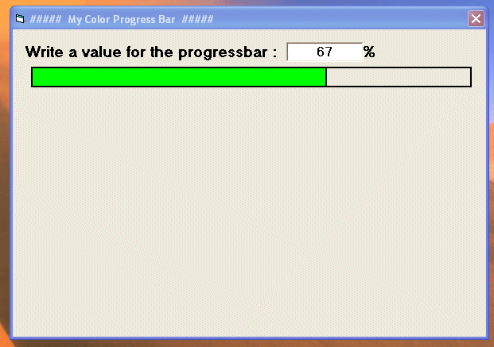



## \[ A color Progress Bar \]

### Description

A color progress bar!, I made this because I wanted to have a color progress bar, cause I don't have any components for color progress bars so : I share with you all! If you like this little example --->Vote please!
 
### More Info
 

             |
---                |---
**Submitted On**   |2005-02-21 12:45:02
**By**             |[Power Of Anubis](https://github.com/Planet-Source-Code/PSCIndex/blob/master/ByAuthor/power-of-anubis.md)
**Level**          |Beginner
**User Rating**    |3.7 (67 globes from 18 users)
**Compatibility**  |VB 6\.0
**Category**       |[Graphics](https://github.com/Planet-Source-Code/PSCIndex/blob/master/ByCategory/graphics__1-46.md)
**World**          |[Visual Basic](https://github.com/Planet-Source-Code/PSCIndex/blob/master/ByWorld/visual-basic.md)
**Archive File**   |[\[\_A\_color\_1855832212005\.zip](https://github.com/Planet-Source-Code/power-of-anubis-a-color-progress-bar__1-59067/archive/master.zip)

